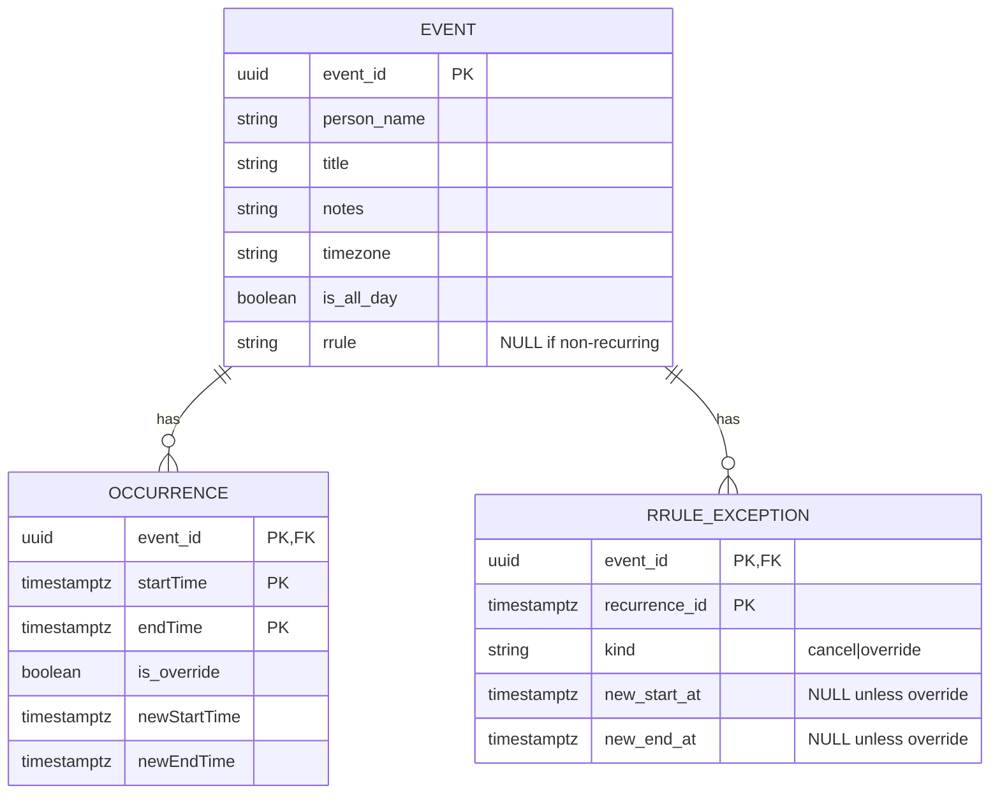

```mermaid
erDiagram
  EVENT ||--o{ OCCURRENCE : "has"
  EVENT ||--o{ RRULE_EXCEPTION : "has"

  EVENT {
    uuid event_id PK
    string person_name
    string title
    string notes
    string timezone
    boolean is_all_day
    string rrule "NULL if non-recurring"
  }

  OCCURRENCE {
    uuid event_id PK,FK
    timestamptz startTime PK
    timestamptz endTime PK
    boolean is_override
    timestamptz newStartTime
    timestamptz newEndTime
  }

  RRULE_EXCEPTION {
    uuid event_id PK,FK
    timestamptz recurrence_id PK
    string kind "cancel|override"
    timestamptz new_start_at "NULL unless override"
    timestamptz new_end_at "NULL unless override"
  }
```